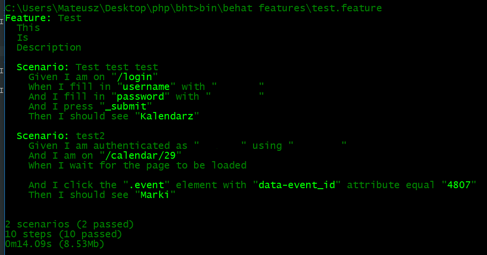

# behat-test
proof of concept, nothing more

### How to run on windows
1. download and install [composer](https://getcomposer.org/download/) (if you don't have it installed already)
2. clone or download and unzip this repo
3. install dependencies with `composer install`
4. download and install [java runtime environment](http://www.oracle.com/technetwork/java/javase/downloads/index.html) if you don't have it already installed
5. download latest version of [selenium standalone server](https://www.seleniumhq.org/download/) and place it in project root directory
6. download and [chromedriver](http://chromedriver.chromium.org/) and place it in project root directory
7. run selenium server with `java -Dwebdriver.chrome.driver=chromedriver.exe -jar selenium-server-standalone-3.14.0.jar`
8. set correct username and password in features\test.feature (it's just a textfile, you can open it with notepad)
9. run behat tests with `bin\behat features\test.feature`

To run this on Linux or MacOS you need to follow basically the same steps, just replace `\` with `/` and remove `.exe` from chromedrive file name.

PS you also need to have google chrome installed. Firefox doesn't work very well with selenium driver.

